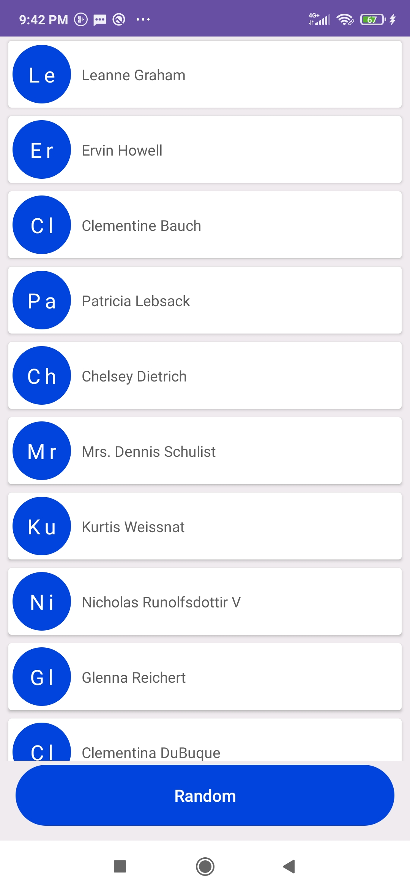

<h1 align="center">Android Technical Task </h1>

## 😎 Task Overview

 <h3>This task provided to convertedin company .</h3>  

  Software stack  • Kotlin • MVI Arch Pattern • Android JetPack Components •
Retrofit 2 • Dagger Hilt • Coroutines   
 

## 🚀 App Screen Shots

  
 
 

 
 
 
  

